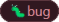
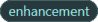
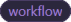

<!--
    !! NOTE !! - ONLY PROJECT OWNERS AND MAINTAINERS MANAGE PRODUCTION AND PREVIEW RELEASE PULL REQUESTS
    If you have contributions to make, use the "feature-to-develop" pull request template.
-->
<!--suppress HtmlDeprecatedAttribute -->
<h1 style="font-weight:bold" align="center">Production Release Pull Request</h1>

<details open><summary>📄Description📄</summary>
<!-- Provide a short, general summary of your changes in the Title above -->

This pull request is for production release **_[add version here]_**
</details>


<h2 style="font-weight:bold" align="center">✅Development Checklist✅</h2>

<details open><summary>🌳Branching🌳</summary>

The release branch name for this pull request has the following the syntax.

Syntax: _release/v&lt;major-number&gt;.&lt;minor-number&gt;.&lt;patch-number&gt;_  
Example: _release/v1.2.3_
- [ ] Yes
- [ ] No

The name of the branch for this pull request is merging into the production branch with the name **_master_**.
- [ ] Yes
- [ ] No

Is the head(source) branch for this pull request created from a branch with the name **_develop_**?
- [ ] Yes
- [ ] No
</details>


<details open><summary>🐛Bugs🐛</summary>

Contains Bug Fix(es)
- [ ] Yes
    - [ ] A  label has been added to the pull request.~~~~
- [ ] No
</details>


<details open><summary>💣Breaking Change(s)💣</summary>

Any changes, including behavioral, that prevent a library user's application from compiling or behaving correctly.
Refer to this [link](https://docs.microsoft.com/en-us/dotnet/core/compatibility/#modifications-to-the-public-contract) for more information.
- [ ] Yes
    - [ ] A  label has been added to the pull request.
- [ ] No
</details>


<details open><summary>✨Enhancements✨</summary>

Contains enhancements that add a feature or behavior.
- [ ] Yes
    - [ ] An  label has been added to the pull request.
- [ ]  No
</details>


<details open><summary>⚙️Workflow (CI/CD) Changes⚙️</summary>

These changes can only done by the project maintainers.
- [ ] Yes
    - [ ] A  label has been added to the pull request.
- [ ] No
</details>


<details open><summary>📃Documentation Updates📃</summary>

Contains changes that require documentation updates to code docs or **Velaptor** documentation
- [ ] Yes
    - [ ] I have updated the documentation accordingly.
    - [ ] A  label has been added to the pull request.
- [ ] No
</details>


<details open><summary>🧪Unit Testing🧪</summary>

My change requires unit tests to be written.
- [ ] Yes
- [ ] No
</details>


<details open><summary>🧪Manual Testing🧪</summary>

I have manually tested my changes.
This can be done by using the included testing application.
- [ ] Yes
- [ ] No
</details>


<h2 style="font-weight:bold" align="center">✅Code Review Checklist✅</h2>

<!-- Go over all of the following points, and put an `x` in all the boxes that apply. -->
<!-- If you're unsure about any of these, don't hesitate to ask. We're here to help! -->
- [ ] Pull request title matches the example below with the correct version.
    - **Example:** 🚀Release To Production - v1.2.3
- [ ] The **_[add version here]_** text in the pull request description was replaced with the version.
- [ ] Issues exist and are linked to this pull request.
- [ ] My code follows the coding style of this project.
    - This is enforced by the *.editorconfig* files in the project and displayed as warnings.  If there is an edge case with coding style that should be ignored or changed, reach out and let's discuss it.
- [ ] All tests passed locally.
    - Status checks are put in place to run unit tests every single time a change is pushed to a pull request.  This does not mean that the tests pass in both the local and CI environment.
- [ ] Update library version by updating the **_\<Version/\>_** and **_\<FileVersion/\>_** tags in the **_Velaptor_** **_.csproj_** file.
    - Every change to a pull request will run a status check to confirm that the version has the correct syntax, a tag does not exist, and that it has not already been published to [nuget](https://www.nuget.org/)
      **Example:**
        ``` html
        <Version>1.2.3</Version>
        <FileVersion>1.2.3</FileVersion>
        ```
- [ ] I have updated the release notes by creating a new production release notes file and adding it to the **_./Documentation/ReleaseNotes/ProductionReleases_** folder.
