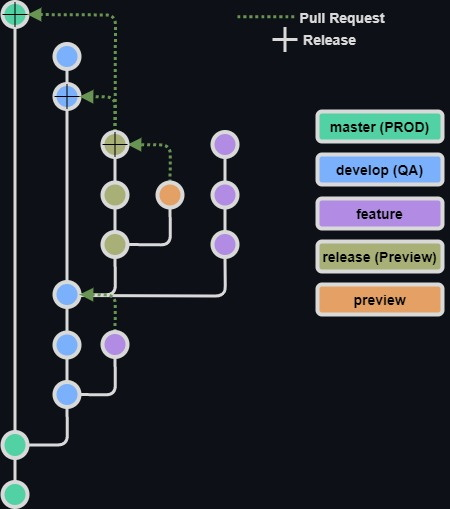

<h1 align="center">Branching</h1>

Velaptor uses a more complicated branching model. But with this comes more control of the SDLC (Software Development Life Cycle).  This branching model allows for a clear purpose for adding features, bug fixes, preview releases, qa releases and standard releases.

As a standard contributor though, all you have to worry about is simply creating feature branches and creating pull requests to merge those branches into the develop branch.  The rest is taken care of by a solid CI/CD system as well as the maintainers of the project.  Only the organization owner and designated team members will manage the release process.  So contributing is still easy!!🥳

**NOTE:** Like everything in software, things are always subject to change.  The branching model is not except from this.  If too many issues or complications occur with the current branching model and/or release process, it can be changed accordingly.

---

<h2 align="center">Branches Used</h2>

<h3 align="center" style="color: #52D1A4;font-weight:bold">Master Branch</h3>

Long living branch that represents stable production versions of **Velaptor**.
- **Branch Syntax:** master
- **Branches That Can Merge Into Master:**
  - release branches via pull request
- **Created From:** none
- **Merges Into:** none
- **Environment:** production
- **CI/CD:**
  - Upon pull request completion, the release branches are merged into the master branch and the master branch is automatically built, tested, and released to production as a nuget package.
  - The testing application is attached as an artifact to the release for the purpose of testing.

<h3 align="center" style="color: #7BB0FC;font-weight:bold">Develop Branch</h3>

Long living branch that represents the most current development being worked on.
- **Branch Syntax:** develop
- **Branches That Can Merge Into Develop Branch:**
  - Feature branches via pull requests
- **Created From:** none
- **Merges Into:** none
- **Environment:** QA
- **CI/CD:**
  - Upon pull request completion of feature branches into the develop branch, the develop branch is automatically built, tested, and deployed as a QA release.
  - The testing application is attached as an artifact to the release for the purpose of testing.
   
<h3 align="center" style="color: #B18BE4;font-weight:bold">Feature Branches</h3>

This branch is where a developer's work will be performed and will be merged back into the develop branch via a pull request.
- **Branch Syntax:** feature/\<issue id\>-\<description\>
  - Example: feature/123-my-branch
- **Branches That Can Merge Into Feature Branches:** None
- **Created From:** develop
- **Merges Into:** develop
- **Environment:** none
- **CI/CD:**
  - Build and unit test status checks are automatically ran for each change to the pull request.
  - All status checks must pass for a pull request to be completed.

<h3 align="center" style="color: #E5D89C;font-weight:bold">Release Branches</h3> 

Represents an arbitrary amount of features and/or bug fixes to be released as a production or preview release.
- **Branch Syntax:** release/v\<major\>.\<minor\>.\<patch\>
  - Example: release/v1.2.3
- **Branches That Can Merge Into Release Branches:**
  - Preview branches via pull request
- **Created From:** develop branch
- **Merged Into:** develop and master branches
- **Environment:** none
- **CI/CD:**
  - Can be a major, minor, or patch release.
  - Can be used for preview releases.
  - Preview releases are only done manually.
  - Build, unit test, and version validation status checks are automatically ran for each change to the pull request.
  - All status checks must pass for a pull request to be completed.
  - When a release is performed, 2 pull requests are created.  One for a merge into the develop branch and one for a merge into the master branch.
  - Upon merging into the develop (QA) branch, a qa release will be automatically performed.
  - Upon merging into the master (Production) branch, a production will be automatically performed.

<h3 align="center" style="color: #E4A06C;font-weight:bold">Preview Branches</h3>

Holds minimal changes for the purpose of making the upcoming release more stable.  Things such as refactoring, bug fixes, and changes related to serving the main purpose of the upcoming release.  Changes such as introducing additional major features outside of features in the upcoming release are not allowed.
- **Branch Syntax:** preview/v\<major\>.\<minor\>.\<patch\>-preview.\<prev number\>
  - Example: preview/v1.2.3-preview.4
- **Branches That Can Merge Into Preview Branches:** none
- **Created From:** release branches
- **Merged Into:** release branches
- **Environment:** none
- **CI/CD:**
  - The major, minor, and patch numbers of the preview branch must match the numbers release branch that it was created from and being merged into.
  - Used to add changes to a release branch.  Think feature branches for release branches.
  - Build, unit test, and version validation status checks are automatically ran for each change to the pull request.
  - All status checks must pass for a pull request to be completed.

---

<h2 align="center">
   

      Branching Diagram
   

   
</h2>

   [< Linux Dev Env Setup](./EnvironmentSetup/LinuxDevEnvSetup.md)
    

