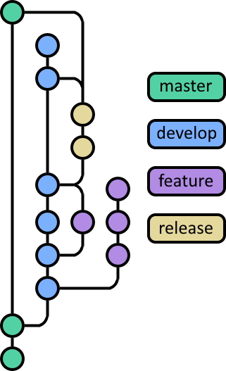

<h2 align="center">
    
     
</h2>

<h1 style="font-weight:bold" align="center">Velaptor</h1>

<h2 style="font-weight:bold" align="center" >!! NOTE !!</h2>

This library is still under develop and is not at v1.0.0 yet!!  All of the major features are there though so we encourage you to use it and report back on issues and improvements.  That is what open source is all about. 🙂

<h2 style="font-weight:bold" align="center">Features</h2>

### Cross-Platform
We strive for **Velaptor** to be a cross platform library by running under **.NET v5.0**.  There are plans for this library to continually be updated as we approach **.NET 6.0** and beyond.

### Easy to use
One of the goals of this library is to make sure that the it is easy to use.  Everything from naming, documentation and the usability of the how API needs to be simple and easy.

### Flexible Content Loading System
**Velaptor** has the ability to load texture atlas image and JSON data for texture atlas type rendering as well as single image content and sound content.  The content loading system is flexible and has an API that has the ability to be extended to load custom content for your media applications and games.

### Content Caching
Loaded content such as images and sounds are cached for reuse and performance reasons.  If the same content is loaded from disk after it has already been loaded, the same image content will be used for rendering.  This is the same for sounds and texture atlas data.  Custom content loading will not come with caching and will have to be added.

<h2 style="font-weight:bold" align="center">Maintainers</h2>

We currently have the following maintainers:
* [Calvin Wilkinson](https://twitter.com/KDCoder) 

<h2 style="font-weight:bold" align="center">Building And Dev Environment Setup</h2>

1. Click [here](./Documentation/EnvironmentSetup/WindowsDevEnvSetup.md) for instructions on development and environment setup for windows.

2. Building on linux machines still needs to be setup and defined.

<h2 style="font-weight:bold" align="center">Contributing</h2>

**Velaptor** encourages and uses [Early Pull Requests](https://medium.com/practical-blend/pull-request-first-f6bb667a9b6). Please don't wait until you're finished with your work before creating a PR.

1. We use a branching strategy that has 5 branches
   * master - This is is a long living branch for the purpose of stable production versions of the library.
   * develop - This branch holds the current development work being produced for an upcoming release
   * feature/my-features - This branch is where development work will be performed and will be merged into the develop branch via a pull request.  When this is created from the develop branch, it will only be merged back into the develop branch for the purpose of fixing bugs or adding new features.
   * release/v1.2.3 - This branch is created from the develop branch to encompass a number of features that can be released to production and is where extensive testing will occur before a release.  Pre-release nuget packages will be created from this branch until deemed to be ready for a production release.  Pre-release nuget packages will only be created from release branches that follow the syntax release/v*.*.\*.
   Once the prerelease is ready to be released, a PR will be created which merges this branch into the master branch, which then creates a stable production release of the library.  A PR will also be created and them merged into the develop branch to update current development.  When these changes come into the develop branch, all current branches need to manually merge in the new develop branch changes into each PR's feature branch to get them up to date.  When contributing to a release, the branch syntax release/\<simple-description\> should be used.  Release branch PR's should be merged back into the version release branch with the version syntax.  For example, if there is a release branch with the name release/v1.2.0, which represents a current pre-release version of **v1.2.0-prerelease.3**, a contribution branch should be created **FROM** this release branch.  If your branch name is release/my-bug-fix, this will get merged back into the release/v1.2.0 release branch which would become a new release version of **v1.2.0-prerelease.4**.
   PR's tagged with **pre-release** will be used to make it easy to know that the branch for the PR  is for the purpose of making changes to a **pre-release**.  

<h3 align="center" style="color:mediumseagreen;font-weight:bold">!! NOTE !!</h3>
   
The release process is more complicated with it's more rigid process.  The purpose of this is to help deal with pre-releases and keeping high testability in mind.  Currently only team members/contributors will manage this process.   

2. Fork the repository
3. Add an empty commit to a new branch to start your work off: `git commit --allow-empty -m "start of [thing you're working on]"`
4. Once you've pushed a commit, open a [**draft pull request**](https://github.blog/2019-02-14-introducing-draft-pull-requests/). Do this **before** you actually start working.
5. Make your commits in small, incremental steps with clear descriptions.
6. All unit tests must pass before a PR will be completed.
7. Make sure that code follows the project set coding standards.
8. Tag a maintainer when you're done and ask for a review!

<h2 align="center">
   

      Branching Diagram
   

   
</h2>

<h2 style="font-weight:bold" align="center">Practices</h2>

1. The code base is highly tested using unit testing and a high level of code coverage is maintained.  When contributing, make sure to add or adjust the unit tests appropriately regarding your changes.
2. We use a combination of [StyleCop](https://github.com/DotNetAnalyzers/StyleCopAnalyzers) and [Microsoft.CodeAnalysis.NetAnalyzers](https://github.com/dotnet/roslyn-analyzers) libraries for maintaining coding standards.
   * We understand that there are some exceptions to the rule and not all coding standards fit every situation.  In these scenarios, contact a maintainer and lets discuss it!!  Warnings can always be suppressed if need be.
3. We use [semantic versioning 2.0](https://semver.org/) for versioning.

<h1 style="font-weight:bold" align="center">Further Resources</h1>

- The sample project named **VelaptorTesting** can be found in the [Testing Folder](https://github.com/KinsonDigital/CASPL/tree/master/Testing/VelaptorPlayground)
  * This project serves the purpose of a sample project as well as a simple way to do manual testing of the library
- [CASL](https://github.com/KinsonDigital/CASL) is used for audio.
- Powered by [Silk.NET](https://github.com/dotnet/Silk.NET).

<h1 style="font-weight:bold" align="center">Licensing And Governance</h1>

**Velaptor** is distributed under the very permissive MIT license and all dependencies are distributed under MIT-compatible licenses.
This project has adopted the code of conduct defined by the [Contributor Covenant](http://contributor-covenant.org/) to clarify expected behavior in our community.
